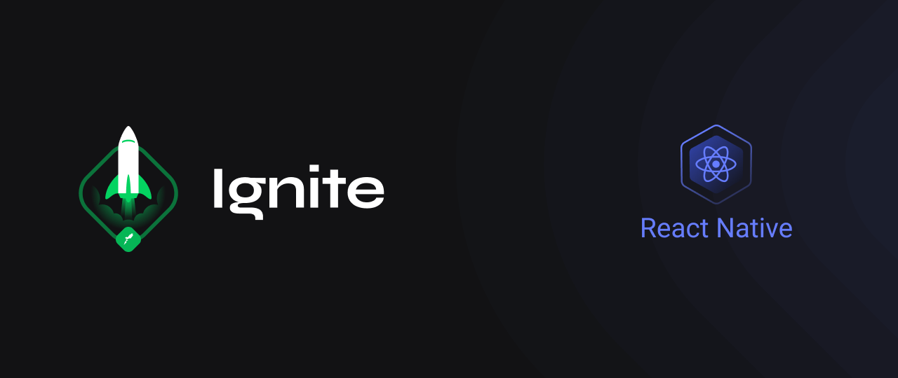
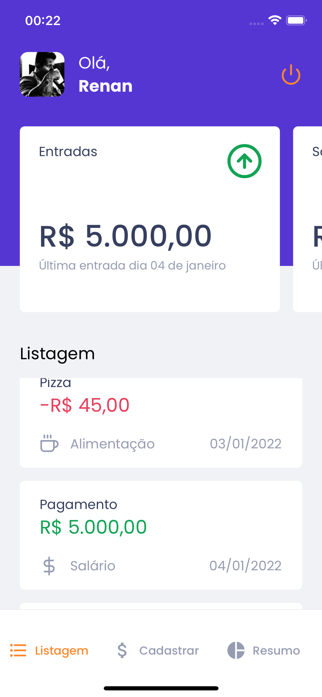
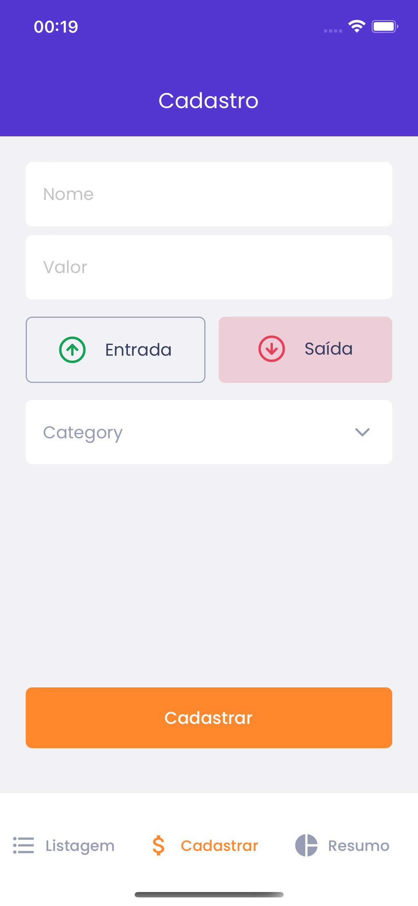
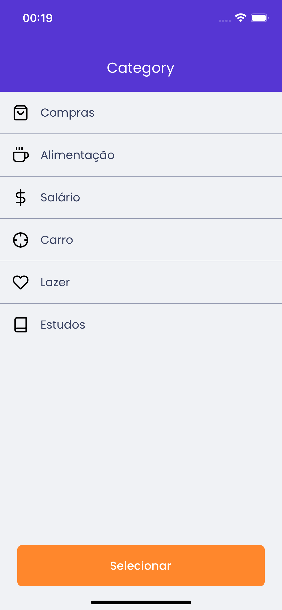
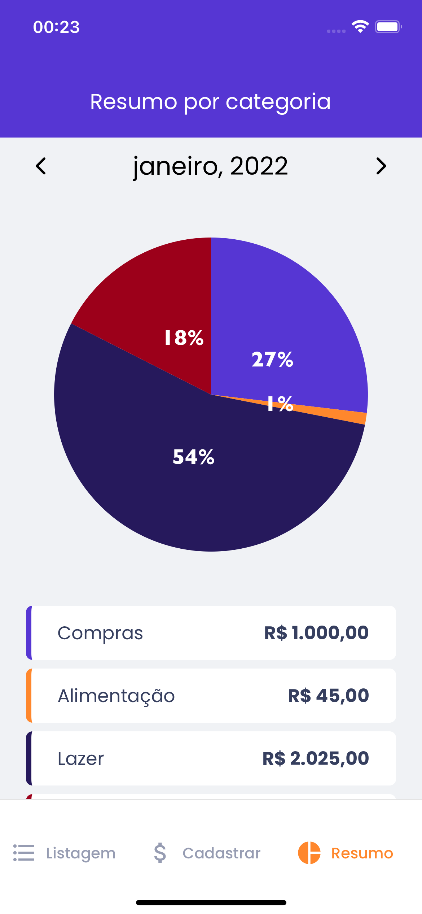

<!--banner-->
<div align="center">
  
</div>

<br/>

<!--logo-->
<div align="center">
  
</div>

## Sobre o projeto
Gofinances é uma app para o gerenciamento das finanças, que disponibiliza um gráfico com suas despesas mensais dividas em categorias.


#### Projeto desenvolvido durante o programa ignite, no chapter II da trilha de React Native.


## 📌 Contents
- [Sobre o projeto](#sobre-o-projeto)
    - [Projeto desenvolvido durante o programa ignite, no chapter II da trilha de React Native.](#projeto-desenvolvido-durante-o-programa-ignite-no-chapter-ii-da-trilha-de-react-native)
- [📌 Contents](#-contents)
- [🚀 Technologies](#-technologies)
- [📷 Screenshot](#-screenshot)
- [💻 How to run](#-how-to-run)
- [License](#license)
  

## 🚀 Technologies
* [Typescript](https://www.typescriptlang.org/)
* [React Native](https://reactnative.dev/)
* [Expo](https://docs.expo.dev/)
* [Styled Components](https://styled-components.com/)

## 📷 Screenshot
<div align="center">
  
  
  
  
  
</div>


## 💻 How to run
```
  # Clone Repository
  $ git clone https://github.com/renanloureiroo/gofinances.git
```

```
  # Install Dependencies
  $ yarn 

  # Run application
  $ expo start
```

## License
[MIT](https://choosealicense.com/licenses/mit/)